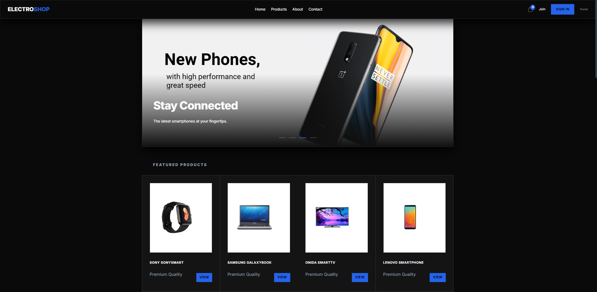
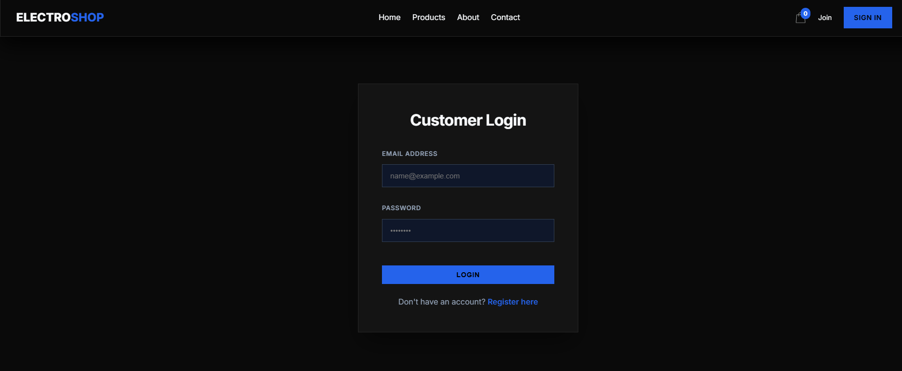
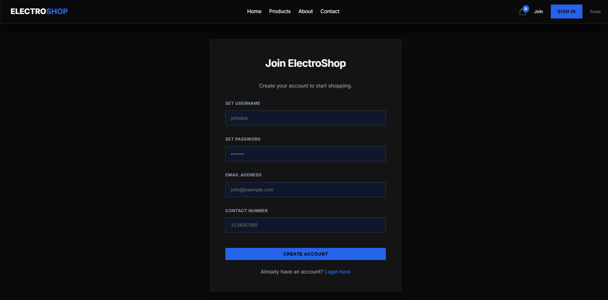
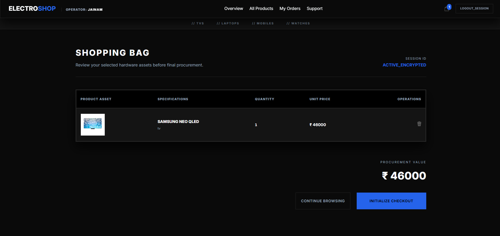
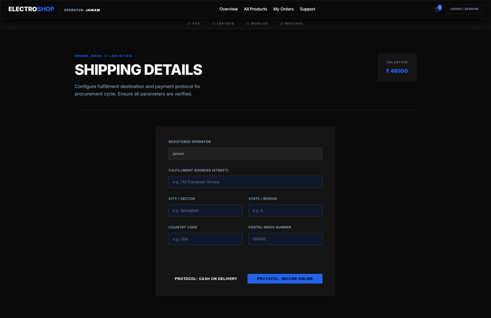
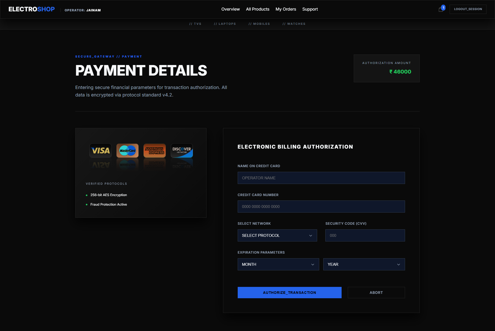
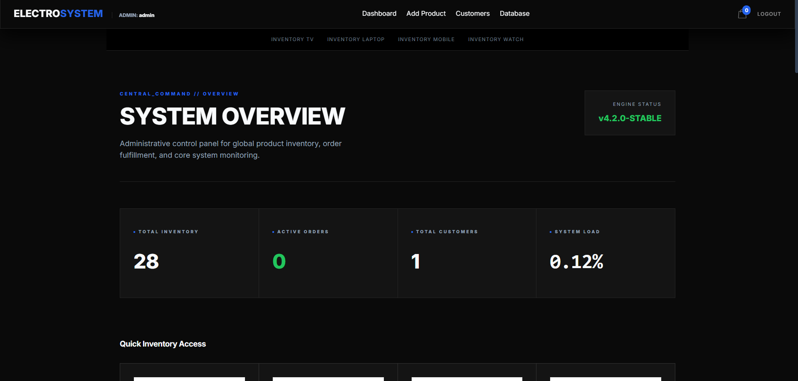
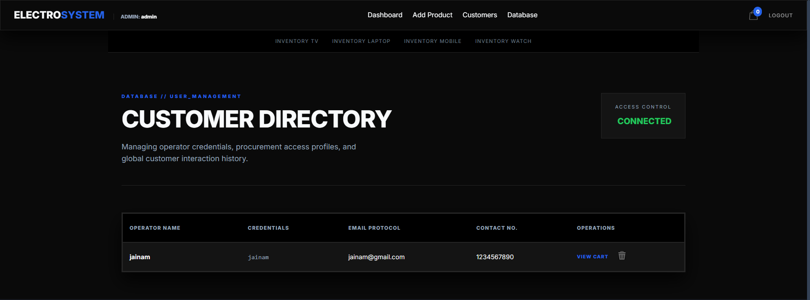
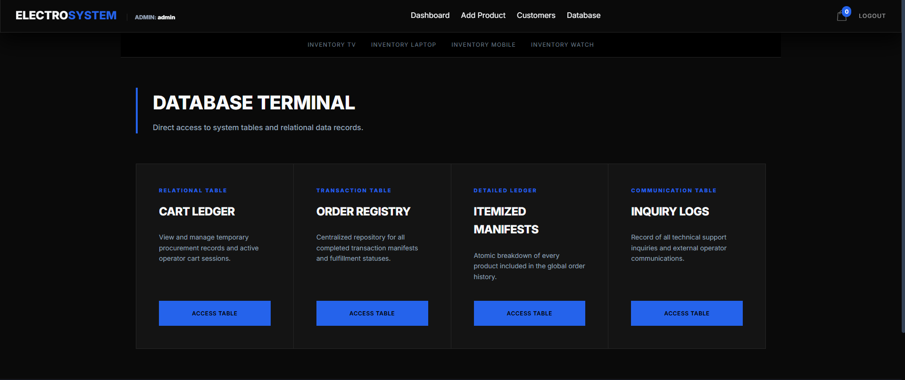

# 🛍️ Electro Shop - Professional E-Commerce Ecosystem

[](https://www.java.com/)
[](https://javaee.github.io/servlet-spec/)
[](https://www.mysql.com/)
[](https://glassmorphism.com/)
[](https://maven.apache.org/)

**Electro Shop** is a comprehensive, enterprise-grade e-commerce solution designed with a focus on high performance and modern aesthetics. Built using the Java EE architecture, it implements a robust MVC (Model-View-Controller) pattern to deliver a scalable shopping platform for electronics.

---

## 📑 Table of Contents

- [🌟 Project Overview](#-project-overview)
- [✨ Key Features](#-key-features)
  - [🛡️ User Authentication](#-user-authentication)
  - [📦 Product Management](#-product-management)
  - [🛒 Shopping Lifecycle](#-shopping-lifecycle)
  - [💳 Payment & Orders](#-payment--orders)
  - [🛠️ Administrative Suite](#-administrative-suite)
- [💻 Technical Stack](#-technical-stack)
- [📸 Project Output & Screenshots](#-project-output--screenshots)
- [🚀 Comprehensive Setup Guide](#-comprehensive-setup-guide)
- [🗄️ Database Architecture](#-database-architecture)
- [📂 Deep Dive: Project Structure](#-deep-dive-project-structure)
- [🤝 Contributing](#-contributing)
- [📜 License](#-license)

---

## 🌟 Project Overview

Electro Shop isn't just an e-commerce site; it's a demonstration of modern Java web development. It leverages the power of **JSP (JavaServer Pages)** for dynamic content rendering and **Java Servlets** for robust backend logic. The UI is crafted using a unique **Industrial Glassmorphic Design**, providing a frosted-glass effect that feels premium and state-of-the-art.

---

## ✨ Key Features

### 🛡️ User Authentication
- **Secure Registration:** Multi-field validation for name, email, contact, and password.
- **Role-Based Login:** Separate authentication portals for Customers and Administrators.
- **Session Management:** Secure cookie and session handling to maintain user state.

### 📦 Product Management
- **Categorized Browsing:** Specialized sections for Laptops, Mobiles, TVs, and Watches.
- **Rich Product Views:** Detailed product pages with high-quality images and specifications.
- **Dynamic Inventory:** Real-time quantity tracking and management.

### 🛒 Shopping Lifecycle
- **Guest vs. Registered Cart:** Supports cart operations for both guests and logged-in users.
- **Persistent Cart:** Items remain in the cart across sessions for registered users.
- **AJAX-like Experience:** Seamless updates to cart quantities and totals.

### 💳 Payment & Orders
- **Shipping Address Suite:** Comprehensive form to collect and save delivery details.
- **Virtual Payment Gateway:** Realistic simulation of credit/debit card transactions with validation.
- **Order Confirmation:** Instant generation of order IDs and detailed summaries.
- **Tracking System:** Customers can view the history and status of all their previous orders.

### 🛠️ Administrative Suite
- **Insightful Dashboard:** High-level metrics on store performance.
- **Inventory Control:** Add new products, update existing listings, or remove outdated stock.
- **Customer Oversight:** View all registered customers and manage their accounts.
- **Database Table View:** A specialized tool for administrators to inspect database tables directly through the browser.

---

## 💻 Technical Stack

| Component | Technology |
| :--- | :--- |
| **Backend** | Java 8+, Servlets 3.1 |
| **Frontend** | JSP, Vanilla CSS3 (Glassmorphism), JavaScript (ES6) |
| **Database** | MySQL 8.0 / SQLite 3.x |
| **Build System** | Apache Maven |
| **Server** | Apache Tomcat 9.0+ |
| **Libraries** | JDBC, Commons FileUpload, Commons IO, JSTL |

---

## 📸 Project Output & Screenshots

Below is a detailed walkthrough of the application's interface and functionality.

### 1. The Gateway (Landing Page)
The primary entry point featuring a sleek navigation bar and a glassmorphic hero section.


---

### 2. User Onboarding (Authentication)
Clean, minimalist forms for registration and login, designed for maximum conversion.
| Customer Login | Customer Registration |
| :---: | :---: |
|  |  |

---

### 3. The Shopping Experience
A cohesive flow from cart management to secure checkout.

#### **A. Shopping Cart**
A detailed view of selected items with total calculations and item removal options.


#### **B. Shipping Details**
A professional form to capture delivery information with built-in validation.


#### **C. Payment Gateway**
A simulated secure payment interface for processing credit and debit card information.


---

### 4. Administrative Control Center
High-power tools for managing the entire platform.

#### **A. Admin Dashboard**
The main control panel for the store administrator.


#### **B. Customer Management**
A complete list of all users with options to manage their data.


#### **C. Database Table Inspector**
A unique tool allowing admins to view raw table data directly.


---

## 🚀 Comprehensive Setup Guide

### 1. Prerequisites
- **JDK 11+** (Java Development Kit)
- **Apache Tomcat 9.x**
- **MySQL Server 8.0**
- **Maven 3.6+**

### 2. Database Installation
```sql
-- Create the database
CREATE DATABASE ecommerce;
USE ecommerce;

-- Note: The application will automatically attempt to create tables
-- on the first run, but you can manually import the schema if needed.
```

### 3. Application Configuration
Open `src/main/java/com/conn/DBConnect.java` and update the connection string:
```java
public static Connection getConn() {
    try {
        Class.forName("com.mysql.cj.jdbc.Driver");
        // Update URL, Username, and Password
        conn = DriverManager.getConnection("jdbc:mysql://localhost:3306/ecommerce", "root", "your_password");
    } catch (Exception e) {
        e.printStackTrace();
    }
    return conn;
}
```

### 4. Build and Deploy
1. Open your terminal in the project root.
2. Build the WAR file: `mvn clean package`.
3. Copy `target/EcommerceApp.war` to your Tomcat `webapps` folder.
4. Start Tomcat and navigate to `http://localhost:8080/EcommerceApp`.

---

## 🗄️ Database Architecture

The system uses a relational schema designed for consistency and speed. Key tables include:

- **`customer`**: Stores user credentials and contact information.
- **`product`**: Inventory details including price, quantity, and images.
- **`cart`**: Temporary and persistent storage for items selected by users.
- **`orders`**: Transaction records linking customers to their purchases.
- **`order_details`**: Itemized list of products within each order.
- **`category` & `brand`**: Classification systems for product organization.

---

## 📂 Deep Dive: Project Structure

```text
EcommerceApp/
├── src/main/java/com/
│   ├── conn/       # Database connection factory (DBConnect.java)
│   ├── dao/        # Data Access Objects (DAO, DAO2, DAO3, etc.)
│   ├── entity/     # Model/Pojo classes (Product, Customer, Order)
│   ├── servlet/    # Controller layer handling HTTP requests
│   └── utility/    # Helper classes for file uploads and encryption
├── src/main/webapp/
│   ├── Css/        # The Glassmorphic design system
│   ├── images/     # Dynamic product image storage
│   ├── WEB-INF/    # Deployment descriptor (web.xml)
│   └── *.jsp       # View layer (Home, Cart, Login, Admin)
├── screenshots/    # Visual documentation assets
└── pom.xml         # Maven configuration and dependencies
```

---

## 🤝 Contributing
1. Fork the Project.
2. Create your Feature Branch (`git checkout -b feature/AmazingFeature`).
3. Commit your Changes (`git commit -m 'Add some AmazingFeature'`).
4. Push to the Branch (`git push origin feature/AmazingFeature`).
5. Open a Pull Request.

---

## 📜 License
Distributed under the MIT License. See `LICENSE` for more information.

---

<p align="center">
  <b>Designed & Engineered by Jainam Khara</b><br>
  <i>Empowering Digital Commerce with Java</i>
</p>
